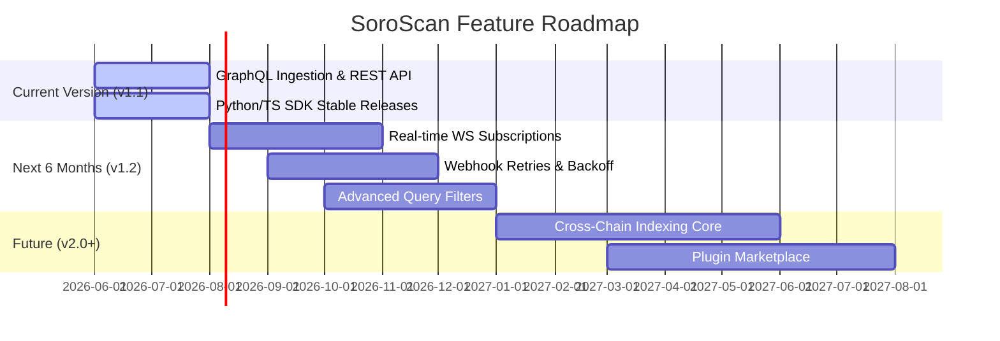

# SoroScan Project Roadmap & Strategic Vision

This document details the long-term vision, feature roadmap, technical progression, release schedule, and strategic priorities for **SoroScan**—the developer-focused indexing service for Soroban smart contracts on the Stellar blockchain.

---

## 1. Strategic Vision Statement

### 1.1 Purpose and Core Values
SoroScan exists to remove complexity from blockchain integration. On-chain events are the primary interface for off-chain application integration; SoroScan makes these events instant, reliable, and queryable.
- **Developer First**: Focus on intuitive APIs, fast indexing latency, and exhaustive developer tooling (SDKs, playgrounds).
- **Correctness & Auditability**: Provide guarantee of data parity with on-chain ledgers.
- **Open and Extensible**: Ensure self-hosting is simple and developers can build custom plugin-based pipelines on top of SoroScan.

### 1.2 Target Users & Use Cases
1. **DApp Developers**: Tracking real-time user actions, token transfers, swap rates, and liquidity pools.
2. **DeFi Protocols**: Monitoring contract states, governance proposals, oracle updates, and flash loans.
3. **Auditing Teams & Analysts**: Conducting historical transaction audits, performance analyses, and event compliance checking.

### 1.3 Strategic Goals (1-3 Years)
- **Year 1**: Establish SoroScan as the standard event-indexing option for the Stellar/Soroban ecosystem. Deliver sub-second indexing latency.
- **Year 2**: Transition from a single-chain indexer to a multi-chain architecture (supporting EVM, Cosmos, or Polkadot alongside Soroban).
- **Year 3**: Decentralize the data verification layer, allowing validator networks to cross-verify indexed event states.

---

## 2. Feature Roadmap



### 2.1 Planned Features (Next 6 Months)
- **GraphQL Subscriptions (WebSockets)**: Enable client apps to listen to events directly from the UI without polling.
- **Reliable Webhooks**: Implement dead-letter queues, exponential backoff retries, and delivery signatures for webhooks.
- **Schema-Based Event Parsing**: Automatic decoding of complex contract return values (using contract WASM bytecode metadata).

### 2.2 Future Considerations (12+ Months)
- **Custom Indexer Plugins**: Allow developers to deploy JavaScript/Python plugins directly into SoroScan to aggregate events and construct custom views on the fly.
- **GraphQL API Rate Customizer**: Fine-grained query costs based on database resource usage.

---

## 3. Technical Roadmap

SoroScan must evolve to handle increasing Stellar ledger throughput and maintain service-level objectives (SLOs).

### 3.1 Architecture Upgrades

```mermaid
graph TD
    subgraph Current Architecture
        C_Node[Soroban Node] --> C_Ingest[Django Ingestion Worker]
        C_Ingest --> C_DB[(Postgres DB)]
        C_DB --> C_API[Django API]
    end
    
    subgraph Target Architecture (v2.0)
        T_Node[Soroban Node] --> T_RustIngest[Rust Ingestion Worker]
        T_RustIngest --> T_Kafka[Kafka/Kafka-like Queue]
        T_Kafka --> T_DB[(Postgres Partitioned DB)]
        T_Kafka --> T_ClickHouse[(ClickHouse Analytics)]
        T_ClickHouse --> T_GraphQL[Go/GraphQL Gateway]
    end
```

### 3.2 Performance & Scalability Targets

| Metric | Current Baseline | Target (Next 6 Months) | Target (12+ Months) |
| :--- | :--- | :--- | :--- |
| **Ingestion Latency** | ~2.5 seconds | < 1.0 second | < 250 milliseconds |
| **GraphQL Query p95** | 180 milliseconds | < 80 milliseconds | < 30 milliseconds |
| **Max Event Throughput**| 500 events/sec | 2,000 events/sec | 10,000+ events/sec |

### 3.3 Reliability Objectives (SLOs)
- **API Availability**: 99.9% uptime per calendar month.
- **Ingestion Success**: 99.99% of emitted events on-chain must be ingested within 5 minutes.
- **Webhook Delivery**: 99.5% delivery success rate (excluding client-side 4xx issues).

---

## 4. Infrastructure & Multi-Chain Roadmap

- **Geographic Expansion**: Deploy edge caches and read-replicas across North America, Europe, and Asia-Pacific to reduce user-facing API latency.
- **Multi-Chain Support**: Abstract the ingestion framework to support EVM logs and Solana program events in SoroScan v2.0.
- **Database Partitioning**: Implement time-series table partitioning in PostgreSQL on `EventRecord` by ledger date to speed up historical lookups.

---

## 5. Community & SDK Ecosystem

- **SDK Parity**: Maintain release parity between Python and TypeScript SDKs. Implement automated contract validation helpers in both libraries.
- **SoroScan Plugin Ecosystem**: Build standard dashboard plugins (e.g. Token Transfer tracker, NFT Minting analytics).
- **API Stability Guarantee**: SoroScan will support legacy API routes for a minimum of 6 months following a major version release.

---

## 6. Version Release Schedule

### 6.1 Release Cadence
- **Patch Releases**: Bi-weekly (bug fixes, styling corrections, dependencies).
- **Minor Releases**: Monthly/Quarterly (new features, performance enhancements, API extensions).
- **Major Releases**: Annually (breaking changes, architectural rewrites).

### 6.2 Deprecation & Support Timeline

| Version | Release Date | Active Support | Maintenance Support | EOL (End of Life) |
| :--- | :--- | :--- | :--- | :--- |
| **v1.0** | 2025-10 | Ends 2026-06 | Ends 2026-12 | 2027-01-01 |
| **v1.1** | 2026-05 | Active | Ends 2027-05 | 2027-11-01 |
| **v1.2 (Planned)** | 2026-11 | Pending | - | - |

---

## 7. Known Limitations & Technical Debt

- **Monolithic Ingest Layer**: The Django worker handles block polling, parsing, and persisting. This will be refactored into a lightweight Go/Rust consumer.
- **Table Bloat**: High webhook logging volume causes index bloat. Auto-pruning schedules have been introduced, but partition-based drop commands are the preferred solution.
- **Mock Ledger Testing**: Current unit tests mock RPC connections. A local Soroban sandbox integration will be added to the CI pipeline to run integration tests against a live mock ledger.
