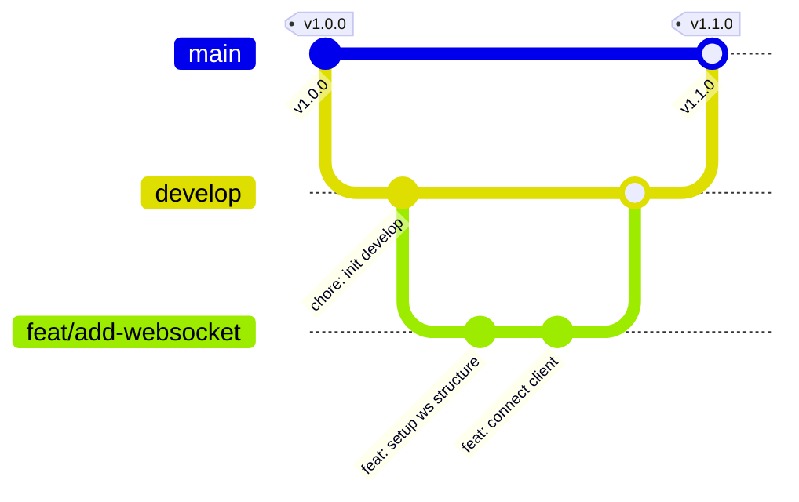

# Git & Pull Request Workflow

We use a collaborative workflow to maintain the stability and history of the SoroScan codebase. This guide explains our branch conventions, commit formatting, and code review procedures.

---

## 1. Branching Strategy

SoroScan maintains a simple and robust branching strategy.



- **`main`**: Represents production-ready code. Commits here must be stable and tested. Releases are tagged from this branch.
- **`develop`**: The primary integration branch. All feature branches are merged here first before being promoted to `main`.
- **Feature Branches (`feat/*`, `fix/*`, `docs/*`, `refactor/*`)**: Created by developers to work on isolated features or fixes. Always create feature branches from `develop` (or `main` for critical hotfixes).

---

## 2. Commit Message Conventions

We enforce the **Conventional Commits** specification. This allows automated changelog generation and semantic versioning.

### 2.1 Format
```
<type>(<scope>): <description>

[optional body]

[optional footer(s)]
```

### 2.2 Allowed Types
- **`feat`**: A new feature for the user or system (maps to a MINOR version bump).
- **`fix`**: A bug fix (maps to a PATCH version bump).
- **`docs`**: Changes to documentation only.
- **`style`**: Formatting changes, missing semi-colons, etc.; no code logic changes.
- **`refactor`**: Code changes that neither fix a bug nor add a feature.
- **`perf`**: A code change that improves performance.
- **`test`**: Adding missing tests or correcting existing tests.
- **`chore`**: Maintenance, package dependencies, tool configurations.

### 2.3 Breaking Changes
If a commit introduces a breaking change, append a `!` to the type or add `BREAKING CHANGE:` in the footer.
```
feat(api)!: remove deprecated REST endpoint for events
```

### 2.4 Example Commits
```
feat(ingest): support parallel streaming of event logs
fix(sdk-python): retry on 503 Service Unavailable errors
docs: update deployment credentials setup guide
```

---

## 3. Squashing, Rebasing, and Cherry-Picking

### 3.1 Keeping Your Branch Up to Date (Rebase)
Do **not** use merge commits to pull changes from `develop` into your feature branch. Instead, use `git rebase` to keep a linear history.
```bash
git fetch upstream
git checkout feat/your-feature
git rebase upstream/develop
```
If you encounter conflicts during rebase, resolve them, then run `git rebase --continue`.

### 3.2 Force Push Rules
- **Prohibited**: You must never force push (`git push -f`) to shared public branches like `main` or `develop`.
- **Permitted**: You may force push to your own personal fork's feature branch (`git push --force-with-lease`) to clean up commits during a rebase.

### 3.3 Squashing
When merging a Pull Request into `develop` or `main`, we use **Squash and Merge**. This squashes all your feature commits into a single commit with a clean Conventional Commit title.

### 3.4 Cherry-Picking Policy
Only cherry-pick when backporting a bug fix from `develop` to a release branch for an emergency patch.
```bash
git checkout release-v1.1
git cherry-pick <commit-hash-from-develop>
```

---

## 4. Pull Request Process

### 4.1 PR Creation
Before opening a PR, ensure:
1. All local unit tests pass.
2. Code style checks (lint/fmt) pass.
3. Your branch is rebased on the latest `develop`.

### 4.2 PR Templates
When opening a PR, fill out the template carefully:
- **Title**: Must follow Conventional Commits (e.g. `feat(graphql): add sorting arguments to events query`).
- **Description**: Add summary of changes, motivation, test steps, and links to issues (`Closes #123`).

### 4.3 Review Process & Required Checks
- **Automated CI Checks**: All PRs trigger a GitHub Actions workflow. The tests, lints, and build steps must pass (green status) before merging.
- **Reviews**: At least **one review approval** from a core maintainer is required.

### 4.4 How to Respond to Review Feedback
- **Address Comments**: Reply to each thread. If you make a code change, push it to your feature branch; the PR will automatically update.
- **Do Not Resolve Threads**: Only the reviewer who asked the question should mark the conversation as resolved once they are satisfied.

---

## 5. Reviewer Guidelines

If you are reviewing another contributor's PR, use these guidelines:

### 5.1 When to Request Changes vs Approve
- **Approve**: If the code is functionally correct, matches the style guide, is covered by tests, and has no performance regressions. (Minor style comments can be left as non-blocking suggestions).
- **Request Changes**: If there are syntax errors, missing test coverage, performance bottlenecks (like N+1 queries), security concerns, or architectural misalignment.

### 5.2 Merging Strategy
SoroScan uses **Squash and Merge** on GitHub.
- Ensure the commit message is formatted correctly before completing the merge.
- Delete the feature branch after a successful merge to keep the repository clean.
