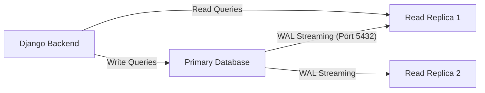
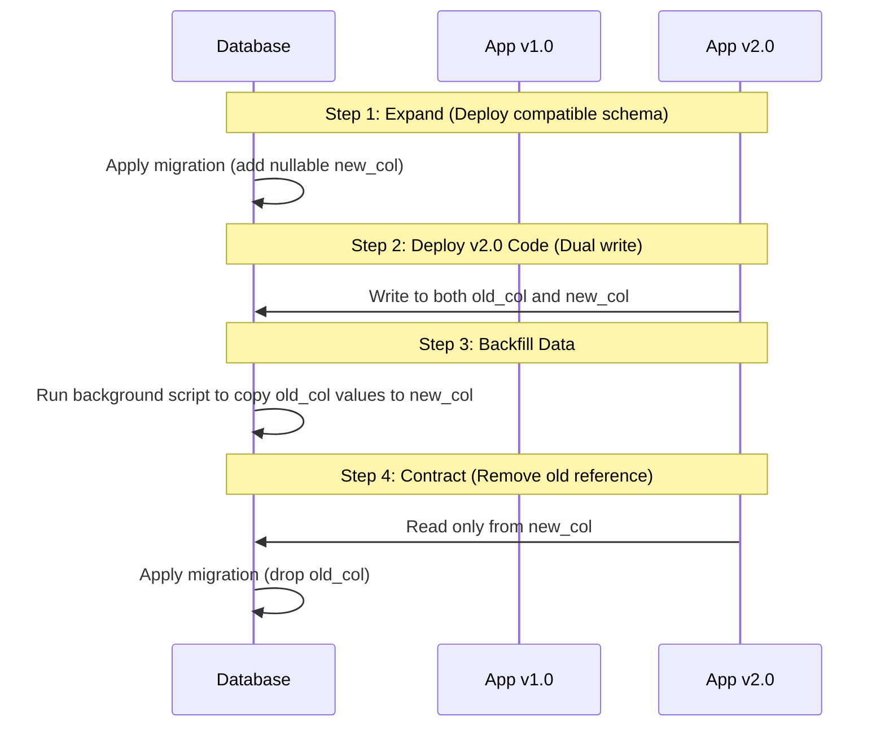

# Database & Cache Administration Guide

This guide provides comprehensive, production-grade instructions and reference materials for managing **PostgreSQL** and **Redis** within the SoroScan ecosystem. It includes operations playbooks, SQL administration scripts, migration strategies, and diagnostic checklists.

---

## 1. PostgreSQL Administration

SoroScan relies on PostgreSQL for persistent storage of transaction logs, indexed events (`EventRecord`), webhook delivery records, and system settings.

### 1.1 Backup Strategy (Full & Incremental)

For production environments, we recommend a hybrid backup strategy:
1. **Full Backups (Daily/Weekly)**: Physical binary backups (`pg_basebackup`) or logical dumps (`pg_dump`) depending on database size.
2. **Continuous Archiving / Incremental (WAL Shipping)**: Write-Ahead Logs (WAL) are continuously archived to secure, off-site object storage (e.g., AWS S3, Google Cloud Storage) every 60 seconds or upon file completion. This enables Point-in-Time Recovery (PITR).

#### Tools
- **pgBackRest** (Recommended for self-hosted / Kubernetes deployments)
- **AWS Aurora/RDS Automated Backups** (For managed cloud deployments)

---

### 1.2 Automated Backup Scheduling

For self-hosted Docker/Kubernetes setups, you can schedule backups using a CronJob or systemd timer.

#### Daily Logical Backup Script (`backup-postgres.sh`)
```bash
#!/usr/bin/env bash
set -Eeuo pipefail

# Configurations
DB_NAME=${POSTGRES_DB:-"soroscan"}
DB_USER=${POSTGRES_USER:-"soroscan_admin"}
BACKUP_DIR="/var/backups/postgres"
DATE=$(date +%Y-%m-%d_%H%M%S)
FILENAME="${BACKUP_DIR}/${DB_NAME}_backup_${DATE}.sql.gz"
LATEST_LINK="${BACKUP_DIR}/${DB_NAME}_backup_latest.sql.gz"

echo "[$DATE] Starting PostgreSQL backup for database: $DB_NAME..."
mkdir -p "$BACKUP_DIR"

# Perform logical dump with compression
pg_dump -h localhost -U "$DB_USER" -d "$DB_NAME" -F p | gzip > "$FILENAME"

# Update latest symlink
ln -sf "$FILENAME" "$LATEST_LINK"

# Keep last 14 days of backups locally
find "$BACKUP_DIR" -name "${DB_NAME}_backup_*.sql.gz" -mtime +14 -delete

echo "[$DATE] Backup completed successfully. File: $FILENAME"
```

#### Cron Schedule (`/etc/cron.d/postgres-backup`)
```cron
# Run daily at 02:00 AM UTC
0 2 * * * postgres /usr/local/bin/backup-postgres.sh >> /var/log/postgres-backup.log 2>&1
```

---

### 1.3 Restore Procedures & Testing

A backup is only as good as its tested restore path. Always test restores on a isolated staging/sandbox instance.

#### Logical Restore Runbook
1. **Prepare target database**:
   ```sql
   -- Terminate existing connections (run as superuser)
   SELECT pg_terminate_backend(pid) 
   FROM pg_stat_activity 
   WHERE datname = 'soroscan' AND pid <> pg_backend_pid();
   
   DROP DATABASE IF EXISTS soroscan;
   CREATE DATABASE soroscan WITH OWNER soroscan_admin;
   ```
2. **Perform restore**:
   ```bash
   gunzip -c /var/backups/postgres/soroscan_backup_latest.sql.gz | psql -h localhost -U soroscan_admin -d soroscan
   ```
3. **Re-analyze statistics**:
   ```bash
   vacuumdb -h localhost -U soroscan_admin -d soroscan --analyze --verbose
   ```

---

### 1.4 Point-in-Time Recovery (PITR)

PITR allows restoring PostgreSQL to any microsecond between the base backup and the latest archived WAL.

#### Enable WAL Archiving (`postgresql.conf`)
```ini
wal_level = replica
archive_mode = on
archive_command = 'test ! -f /var/lib/postgresql/archive/%f && cp %p /var/lib/postgresql/archive/%f'
restore_command = 'cp /var/lib/postgresql/archive/%f %p'
```

#### PITR Restore Workflow
1. Stop the active PostgreSQL service.
2. Clear the PostgreSQL data directory (`PGDATA`), leaving the custom configuration files.
3. Restore the base backup files to `PGDATA`.
4. Create a `recovery.signal` file in `PGDATA` to tell Postgres it is in recovery mode:
   ```bash
   touch /var/lib/postgresql/data/recovery.signal
   ```
5. Configure the recovery target settings in `postgresql.conf` (or `postgresql.auto.conf`):
   ```ini
   restore_command = 'cp /var/lib/postgresql/archive/%f %p'
   recovery_target_time = '2026-06-24 10:15:00 UTC'
   recovery_target_action = 'promote'
   ```
6. Start PostgreSQL. It will replay WALs until the target time is reached and then transition to active primary.

---

### 1.5 Replication Setup (Primary-Replica)

To scale read queries and provide high availability, SoroScan utilizes Streaming Replication.



#### Primary Settings (`postgresql.conf`)
```ini
listen_addresses = '*'
wal_level = replica
max_wal_senders = 10
wal_keep_size = 1024MB # Guard against replica lag disconnects
hot_standby = on
```

#### Replication User Creation (on Primary)
```sql
CREATE ROLE replication_user WITH REPLICATION LOGIN PASSWORD 'SecureReplicationPassword';
```
Add to `pg_hba.conf` on Primary:
```conf
host replication replication_user 10.0.0.0/8 md5
```

#### Replica Initialization
1. Stop target database service.
2. Clear data directory.
3. Run `pg_basebackup` to stream the base state from primary:
   ```bash
   pg_basebackup -h primary-db-host -U replication_user -D /var/lib/postgresql/data -Fp -Xs -P -R
   ```
   *(Note: `-R` generates the appropriate `standby.signal` and connection options automatically.)*
4. Start replica service. Verify replication status on Primary:
   ```sql
   SELECT client_addr, state, sent_lsn, write_lsn, flush_lsn, replay_lsn FROM pg_stat_replication;
   ```

---

### 1.6 Connection Pooling (PgBouncer)

Because Django spawns a connection per thread/process, SoroScan uses **PgBouncer** in **Transaction Mode** to prevent PostgreSQL from running out of file descriptors and memory.

#### Typical `pgbouncer.ini` Config
```ini
[databases]
soroscan = host=localhost port=5432 dbname=soroscan

[pgbouncer]
listen_port = 6432
listen_addr = *
auth_type = scram-sha-256
auth_file = /etc/pgbouncer/userlist.txt
pool_mode = transaction
max_client_conn = 5000
default_pool_size = 50
min_pool_size = 10
reserve_pool_size = 5
reserve_pool_timeout = 5
```

> [!WARNING]
> When using transaction-level pooling, you cannot use PostgreSQL session-level features such as temporary tables, `LISTEN/NOTIFY` (outside specialized connections), or `SET timezone`. Ensure your Django configuration uses client-side parameterization or handles connections safely.

---

## 2. Database Migrations

SoroScan uses the standard Django migrations framework. Because we target a zero-downtime, continuous delivery model, migrations must be designed defensively to prevent exclusive table locks on large tables like `EventRecord`.

### 2.1 Django Migration Workflow

1. Modify `django-backend/soroscan/ingest/models.py`.
2. Generate migration:
   ```bash
   python manage.py makemigrations
   ```
3. Inspect generated SQL to verify lock impact:
   ```bash
   python manage.py sqlmigrate ingest 00XX_migration_name
   ```
4. Run migration in staging/production:
   ```bash
   python manage.py migrate
   ```

---

### 2.2 Writing Safe Migrations (No Locks)

In PostgreSQL, DDL operations (like `ALTER TABLE`) acquire an `ACCESS EXCLUSIVE` lock, which blocks all reads and writes to that table.

#### Safe Column Additions (PostgreSQL 11+)
In PostgreSQL 11+, adding a column with a default value is fast and does **not** rewrite the table:
```python
# Safe in Postgres 11+
status = models.CharField(max_length=20, default='pending')
```

#### Adding Indexes Concurrently
Standard indexing blocks writes. We must create indexes concurrently. In Django, do this by overriding the migration operation or utilizing `AddIndex` with `concurrently=True` inside a migration subclass with `atomic = False`.

```python
# django-backend/soroscan/ingest/migrations/00XX_add_index_concurrently.py
from django.db import migrations

class Migration(migrations.Migration):
    atomic = False  # Crucial! Concurrent indexes cannot run inside a transaction.

    dependencies = [
        ('ingest', '00XX_previous_migration'),
    ]

    operations = [
        migrations.RunSQL(
            sql="CREATE INDEX CONCURRENTLY ingest_event_contract_timestamp_idx ON ingest_event (contract_id, timestamp DESC);",
            reverse_sql="DROP INDEX CONCURRENTLY IF EXISTS ingest_event_contract_timestamp_idx;",
        )
    ]
```

#### Safe Column Deletions
1. Deploy code that stops writing or reading the column.
2. Mark the column as nullable or unused in Django.
3. Drop the column in a database migration.

---

### 2.3 Rolling Back Migrations

If a release fails, you must rollback migrations to a specific state.

```bash
# View migration history and status
python manage.py showmigrations

# Rollback to migration '0012'
python manage.py migrate ingest 0012
```

> [!CAUTION]
> Avoid rolling back migrations that have dropped columns, as this data is permanently deleted. Always maintain database backups before performing DDL updates in production.

---

### 2.4 Migrating Large Tables

Tables containing millions of rows (like `EventRecord` or webhook log history) must be migrated in batches to avoid locking out the indexer.

#### Large Table Migration Strategy: Batching Updates
To add a new non-nullable column populated with data:
1. Add the column as nullable.
2. Write a management command or celery task to populate values in small batches (e.g., 5,000 rows per batch) with sleep intervals:
   ```python
   # Batch update example
   batch_size = 5000
   cursor = 0
   while True:
       updated = EventRecord.objects.filter(id__gt=cursor, new_field__isnull=True).order_by('id')[:batch_size]
       if not updated:
           break
       # Update and set cursor
       ...
       time.sleep(0.1) # Cool down DB
   ```
3. Alter the column to `NOT NULL` once all rows are filled.

---

### 2.5 Zero-Downtime Deployment Strategy (Expand/Contract)

To upgrade the database schema without application downtime, we use the **Expand/Contract Pattern**:



---

## 3. Maintenance Tasks

Database performance degrades over time due to query planner shifts, index fragmentation, and tuple bloating.

### 3.1 Index Maintenance (`ANALYZE`, `REINDEX`)

- **ANALYZE**: Collects statistics about the contents of tables. Run after massive data imports.
- **REINDEX**: Rebuilds indexes to recover space and restore performance.

#### Safe Concurrent Reindexing (Postgres 12+)
```sql
-- Rebuilds an index without blocking reads/writes
REINDEX INDEX CONCURRENTLY ingest_event_contract_timestamp_idx;
```

---

### 3.2 Autovacuum Configuration

Autovacuum is critical for cleaning dead tuples (deleted/updated rows). Event indexers are highly write-heavy, requiring aggressive autovacuum tuning.

#### Recommended Settings (`postgresql.conf`)
```ini
autovacuum = on
autovacuum_max_workers = 4
autovacuum_naptime = 15s
autovacuum_vacuum_threshold = 50
autovacuum_vacuum_scale_factor = 0.05      # Vacuum when 5% of rows change
autovacuum_analyze_threshold = 50
autovacuum_analyze_scale_factor = 0.02     # Analyze when 2% of rows change
autovacuum_vacuum_cost_limit = 2000        # Increase processing capacity
autovacuum_vacuum_cost_delay = 2ms         # Reduce sleep time between vacuum cycles
```

---

### 3.3 Table Bloat Monitoring

Bloat occurs when dead tuples are not reclaimed, causing table size to swell unnecessarily.

#### Bloat Diagnostics Query
```sql
SELECT
  schemaname, tablename, 
  pg_size_pretty(pg_relation_size(schemaname||'.'||tablename)) as table_size,
  pg_size_pretty(pg_total_relation_size(schemaname||'.'||tablename) - pg_relation_size(schemaname||'.'||tablename)) as index_size,
  n_dead_tup,
  round(100 * n_dead_tup / nullif(n_live_tup + n_dead_tup, 0),2) as dead_tuple_pct
FROM pg_stat_user_tables
WHERE (n_dead_tup + n_live_tup) > 10000
ORDER BY dead_tuple_pct DESC;
```

---

### 3.4 Disk Space Management

If disk space reaches 90%, PostgreSQL will fail safe into read-only mode or crash.
- Set up automated alerts at **80% disk capacity**.
- Place `pg_wal` (Write-Ahead Logs) on a separate SSD partition from database data directories if performance scaling requires it.
- Schedule automatic deletion of raw logs or prune old webhook delivery records (keep only last 14 days of `WebhookDeliveryLog`).

---

### 3.5 Regular Health Checks

Run this query daily/weekly to verify index usefulness and cache hit ratios.

#### Cache Hit Ratio (Should be > 99%)
```sql
SELECT 
  sum(heap_blks_read) as heap_read,
  sum(heap_blks_hit)  as heap_hit,
  sum(heap_blks_hit) / (sum(heap_blks_read) + sum(heap_blks_hit) + 0.000001) as ratio
FROM pg_statio_user_tables;
```

---

## 4. Query Troubleshooting

### 4.1 Finding Slow Queries

#### Currently Running Queries
```sql
SELECT pid, age(clock_timestamp(), query_start), usename, query, state
FROM pg_stat_activity
WHERE state != 'idle' AND query NOT LIKE '%pg_stat_activity%'
ORDER BY age DESC;
```

#### Historical Slow Queries (requires `pg_stat_statements`)
Ensure `shared_preload_libraries = 'pg_stat_statements'` is enabled in `postgresql.conf`.
```sql
SELECT 
  query, 
  calls, 
  total_exec_time / 1000 as total_seconds, 
  mean_exec_time as mean_ms, 
  rows
FROM pg_stat_statements
ORDER BY total_exec_time DESC
LIMIT 10;
```

---

### 4.2 EXPLAIN PLAN Analysis

When optimizing, prefix your query with `EXPLAIN (ANALYZE, BUFFERS, VERBOSE)`:
```sql
EXPLAIN (ANALYZE, BUFFERS) 
SELECT * FROM ingest_event WHERE contract_id = 'C...' ORDER BY timestamp DESC LIMIT 20;
```

#### What to Look For:
1. **Sequential Scan (Seq Scan)** vs **Index Scan**: A Seq Scan reads the entire table from disk. If a query filtering on `contract_id` uses a Seq Scan, the table lacks an index on that column.
2. **Filter**: Indicates rows were filtered *after* being loaded. Aim to push filters into the index search.
3. **Buffers**: Shows blocks read from disk vs cached in memory:
   - `shared read`: Read from disk (slow).
   - `shared hit`: Read from RAM buffer cache (fast).
4. **Actual Time**: The actual duration of the step. Compare this against cost estimates.

---

### 4.3 Query Optimization Techniques

- **Partial Indexes**: For events that are heavily queried (e.g. only successful transactions), write indexes with filters:
  ```sql
  CREATE INDEX CONCURRENTLY idx_event_success ON ingest_event(contract_id) WHERE status = 'SUCCESS';
  ```
- **Compound Indexes**: Put the equality filter first, then order parameters:
  ```sql
  -- Matches filtering on contract_id and ordering by timestamp
  CREATE INDEX CONCURRENTLY idx_event_contract_time ON ingest_event(contract_id, timestamp DESC);
  ```
- **Limit/Offset Tuning**: Large offsets (e.g., `LIMIT 100 OFFSET 500000`) force Postgres to scan all preceding rows. Use keyset (cursor-based) pagination instead.

---

### 4.4 Statistics and Selectivity

PostgreSQL maintains statistics on column value distributions to pick query plans.
- If the planner makes poor choices (e.g., choosing Seq Scan instead of Index Scan because it thinks a value is extremely common when it is not), run `ANALYZE table_name`.
- For columns with extreme distribution skew, increase the statistics target:
  ```sql
  ALTER TABLE ingest_event ALTER COLUMN contract_id SET STATISTICS 500;
  ANALYZE ingest_event;
  ```

---

## 5. Redis Administration

SoroScan uses Redis for rate limiting, cache storage, task queues (via Celery), and real-time subscriptions.

### 5.1 Redis Persistence (AOF vs RDB)

Depending on the Redis cluster usage, configure persistence appropriately:

| Use Case | Recommended Persistence | Rationale |
| :--- | :--- | :--- |
| **Celery Tasks & Webhook Queues** | **AOF (Append Only File) + RDB** | Prevents loss of pending webhook delivery tasks on server crash. |
| **Caching & Session Storage** | **No persistence (or RDB only)** | Fast restarts, data can be reconstructed from PostgreSQL. |

#### High-Safety Persistence Configuration (`redis.conf`)
```ini
save 900 1      # Save RDB snapshot if 1 key changes in 15 mins
save 300 10     # Save RDB snapshot if 10 keys change in 5 mins
appendonly yes
appendfsync everysec  # Balance write speed with maximum 1-second data loss safety
```

---

### 5.2 Memory Management and Eviction

When Redis reaches its memory limits, it behaves according to its configured eviction policy.

#### Recommended Memory Config (`redis.conf`)
```ini
maxmemory 4gb # Adjust based on node size (reserve 20% for OS)
maxmemory-policy volatile-lru
```

#### Eviction Policies:
- **`volatile-lru` (Recommended)**: Evicts the least recently used keys *that have an expiration set (TTL)*. This prevents caching from ejecting Celery job queues or rate limit counters that do not have TTLs.
- **`allkeys-lru`**: Evicts any key based on LRU algorithm. Use only if Redis is dedicated solely to caching.
- **`noeviction`**: Returns out-of-memory errors on writes. Set this if data loss on queues is strictly unacceptable.

---

### 5.3 Key Expiration Strategy

To protect Redis capacity, **every cached item must have a Time-To-Live (TTL)**.
- **API Cache**: TTL of 60 seconds - 5 minutes.
- **Rate Limit Windows**: TTL of 60 seconds (or length of sliding window).
- **Session Tokens**: TTL of 24 hours.

#### Redis Passive vs Active Expiration
Redis deletes expired keys in two ways:
1. **Passive**: When a key is requested and found to be expired, it is deleted.
2. **Active**: Redis periodically tests random keys for expiration and deletes them to clear memory.

---

### 5.4 Monitoring Redis Health

Use `redis-cli` or Prometheus Exporters to audit Redis node health.

#### Critical Command Line Checks
```bash
# Check memory layout and fragmentation
redis-cli INFO memory

# Analyze current latency
redis-cli --latency -h localhost

# Find slow commands (>10 milliseconds)
redis-cli SLOWLOG GET 10
```

---

### 5.5 Troubleshooting Memory Issues

#### Identifying Memory Consumers
To find which keys are consuming the most memory:
```bash
# Scan database and report largest keys
redis-cli --bigkeys
```

#### Diagnosis Decision Tree (Out of Memory)
```mermaid
graph TD
    A[Redis Out of Memory Error] --> B{Check fragmentation ratio}
    B -- mem_fragmentation_ratio > 1.5 -- > C[High fragmentation: Run MEMORY PURGE or restart Redis]
    B -- mem_fragmentation_ratio <= 1.5 -- > D{Check Used Memory vs Max Memory}
    D -- Cache Bloat --> E[Run redis-cli --bigkeys to identify large key prefixes]
    D -- Eviction failed --> F[Change maxmemory-policy to volatile-lru or increase server RAM]
```

---

## 6. Monitoring & Alerts

Establish the following alerting thresholds in your monitoring infrastructure (e.g., Prometheus / Grafana / Datadog).

### 6.1 PostgreSQL Metrics

- **Connection Count**: Alert if active connections > 85% of `max_connections`.
- **Cache Hit Ratio**: Alert if `< 98%` (indicates insufficient `shared_buffers`).
- **Disk Usage**: Alert at `80%` warning, `90%` critical.
- **Replication Lag**: Alert if replica lag > 50MB or time lag > 10 seconds.
- **Transaction ID Wraparound**: Alert if `age(relfrozenxid) > 150,000,000` (indicates autovacuum failure).

### 6.2 Redis Metrics

- **Memory Usage**: Alert if `used_memory` > 85% of `maxmemory`.
- **Fragmentation Ratio**: Alert if `mem_fragmentation_ratio > 1.5` or `< 0.9`.
- **Connected Clients**: Monitor sudden spikes (indicates connection leaks).
- **Blocked Clients**: Alert if `blocked_clients > 5` (indicates slow operations or CPU thrashing).

---

## 7. Disaster Recovery

### 7.1 Backup Verification Procedures

An untested backup is a vulnerability. Set up an automated testing flow:
1. Every Sunday, a scheduled pipeline provisions a temporary PostgreSQL container.
2. Restores the latest daily backup from storage.
3. Runs a query suite to check integrity:
   - Row count checks on critical tables (e.g. `EventRecord`).
   - Verifies the last indexed ledger block corresponds with the actual blockchain height minus replication lag.
4. Alerts the operations team via webhook if restore or verification fails.

---

### 7.2 Recovery Objectives (RTO & RPO)

SoroScan defines the following service-level objectives for disaster recovery:

| Tier | Service component | Target RTO (Max Downtime) | Target RPO (Max Data Loss) | Recovery Mechanism |
| :--- | :--- | :--- | :--- | :--- |
| **Tier 1** | PostgreSQL | 30 minutes | 5 minutes | Multi-AZ Failover / WAL Point-in-time recovery |
| **Tier 2** | Redis | 1 hour | 15 minutes | RDB snapshot restore / reconstruction from DB |
| **Tier 3** | Ingestion Pipeline | 2 hours | 0 minutes | Re-index blocks from public Soroban RPC network |

---

### 7.3 Testing Disaster Recovery Plan

Conduct simulated DR drills bi-annually:
- **Scenario A: Primary Database Corruption**: Simulate corrupt tables by dropping a mock schema. Verify restoration using WALs to 5 minutes before corruption.
- **Scenario B: Regional Cloud Failure**: Spin up SoroScan in a fallback region using Terraform templates. Verify configurations and event ingestion flow from scratch.
- **Scenario C: Redis Loss**: Force-kill Redis cache. Verify that the application continues serving requests directly from PostgreSQL (degraded state) and recovers cache naturally.
