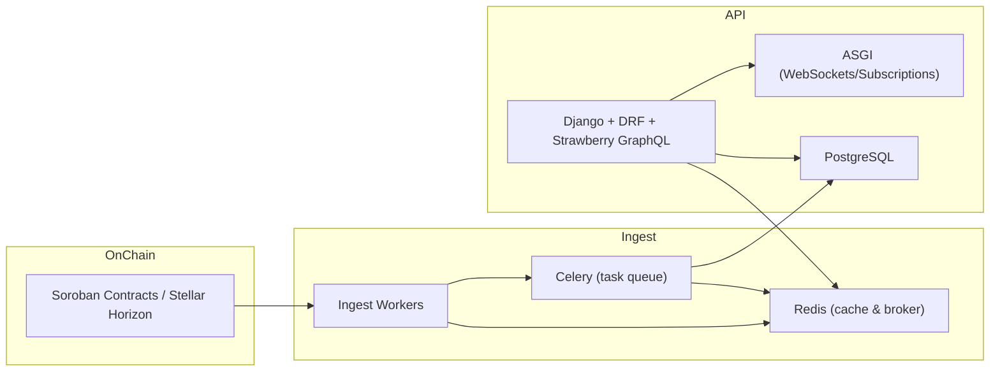

import Tabs from '@theme/Tabs';
import TabItem from '@theme/TabItem';

# SoroScan Production Deployment & Operations

This guide covers recommended production deployments for SoroScan, including local Docker Compose, Kubernetes (Helm + Terraform), an AWS/EKS example, monitoring, backups, security, runbooks, and troubleshooting.

**Quick links**
- [Docker Compose](./docker-compose)
- [Kubernetes (Helm)](./kubernetes)
- [AWS EKS (Terraform)](./aws)
- [Monitoring & Observability](./monitoring)
- [Backups & Disaster Recovery](./backups)
- [Troubleshooting & Runbooks](./runbooks)
- [Security Checklist](./security)
- [Cost Estimates](./costs)

## Decision tree

Use this short decision tree to pick a deployment path:

- Small development/staging: Docker Compose
- Production, multi-tenant, high availability: Kubernetes on cloud (EKS, GKE, AKS)
- Single-tenant or low-ops: Managed PaaS (Heroku/DO App Platform) — see AWS section for guidance

## Architecture (high level)

## Notes and scope
- These docs provide examples and operational guidance. Adapt resource sizes and retention policies to your workload and compliance needs.
- Files included: sample Helm values, a Terraform EKS snippet, and a Postgres backup example.
