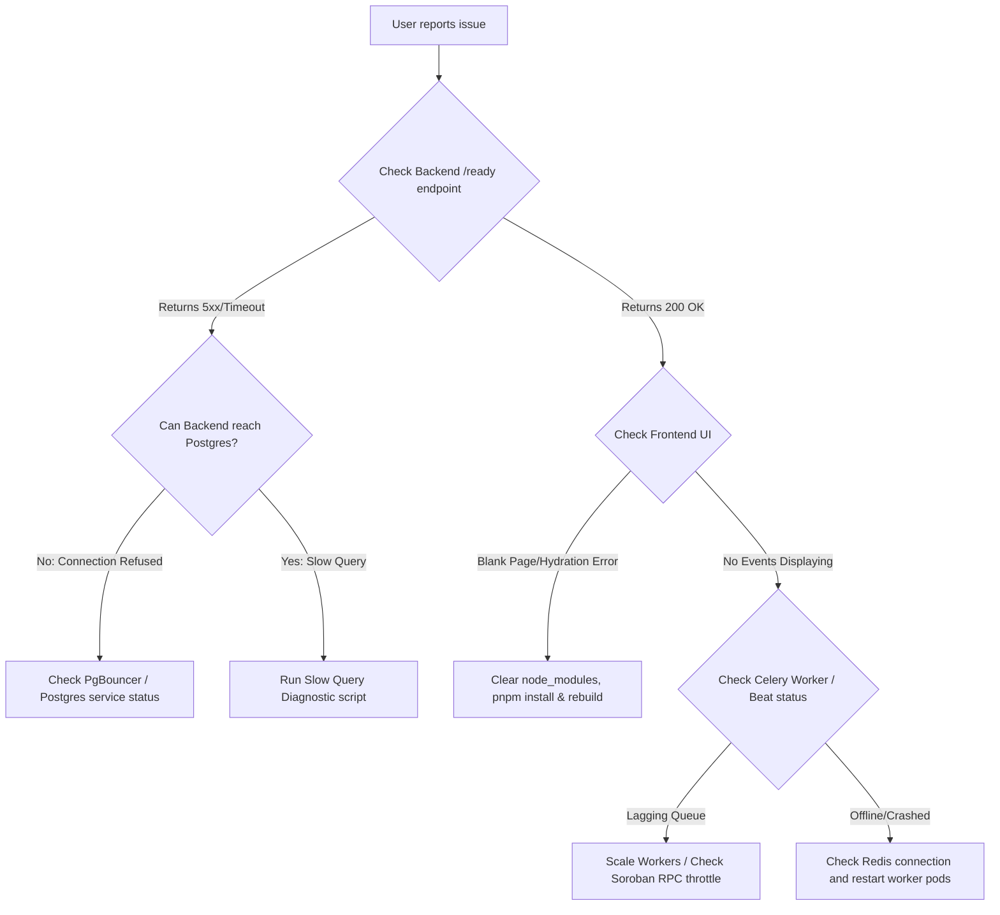

# Troubleshooting Guide & FAQ

This document serves as a living repository of common errors, setup problems, runtime anomalies, performance degradation scenarios, and emergency playbooks. Use the table of contents to jump to the relevant section.

---

## 1. Diagnostic Decision Tree (General Outage)

If SoroScan is down or slow, follow this flowchart to isolate the problem component:



---

## 2. Development Setup Troubleshooting

### 2.1 Port Conflicts
SoroScan uses several local ports:
- `5432`: PostgreSQL
- `6379`: Redis
- `8000`: Django Backend (REST/GraphQL)
- `3000`: SoroScan Frontend Explorer
- `3001`: Admin Dashboard

#### Symptom:
`Error: listen EADDRINUSE: address already in use :::3000` or `Port 8000 is already in use.`

#### Solution:
Find and terminate the process holding the port:
```bash
# Find process using port 8000
lsof -i :8000

# Terminate the process (replace PID with actual process ID)
kill -9 <PID>
```
If using Docker, stop conflicting local services: `sudo systemctl stop postgresql redis-server`.

---

### 2.2 Database Permission Issues
#### Symptom:
`django.db.utils.OperationalError: permission denied for schema public` or `role "soroscan_admin" does not exist`.

#### Solution:
1. Ensure the user role exists and has appropriate permissions:
   ```sql
   CREATE ROLE soroscan_admin WITH LOGIN PASSWORD 'yourpassword';
   ALTER ROLE soroscan_admin CREATEDB;
   GRANT ALL PRIVILEGES ON DATABASE soroscan TO soroscan_admin;
   ```
2. If permissions are broken inside a schema, run:
   ```sql
   GRANT ALL ON SCHEMA public TO soroscan_admin;
   ```

---

### 2.3 Docker Networking Problems
#### Symptom:
`django.db.utils.OperationalError: could not translate host name "db" to address: Name or service not known`.

#### Solution:
Containers must be on the same bridge network. If using `docker-compose.yml`:
- Check that both services are in the same stack.
- Use the service name (`db`, `redis`) as the hostname in `.env`, not `localhost` or `127.0.0.1`.
- Clean docker network layouts:
  ```bash
  docker compose down
  docker network prune -f
  docker compose up --build
  ```

---

### 2.4 Node/Python Version Mismatches
#### Symptom:
- Python: `AttributeError` or missing package support due to old Python. SoroScan requires **Python 3.12+**.
- Node: `pnpm install` errors or failure to build. SoroScan requires **Node.js 18+**.

#### Solution:
- Use **pyenv** to manage Python:
  ```bash
  pyenv install 3.12.0
  pyenv local 3.12.0
  ```
- Use **nvm** to manage Node:
  ```bash
  nvm install 18
  nvm use 18
  ```

---

## 3. Development Workflow Issues

### 3.1 Hot Reload Not Working
#### Symptom:
Modifying frontend code in `soroscan-frontend/app` does not update the browser page automatically.

#### Solution:
1. WSL 2 Users: WSL 2 does not propagate file system watch events to the container easily if code is on the Windows drive. Keep your repository inside the Linux file system (e.g., `/home/username/projects/soroscan`).
2. Increase Linux `inotify` watches:
   ```bash
   echo fs.inotify.max_user_watches=524288 | sudo tee -a /etc/sysctl.conf
   sudo sysctl -p
   ```

---

### 3.2 WebSocket Connection Issues
#### Symptom:
Real-time subscription logs show continuous reconnect attempts or `WebSocket connection to 'ws://...' failed`.

#### Solution:
1. Ensure Django ASGI layer is configured. We run Django channels or standard GraphQL subscription servers.
2. If running locally with Docker Compose, make sure port `8000` routes ASGI/WebSocket connections through the gateway container.
3. Check Nginx or Ingress headers:
   ```nginx
   proxy_set_header Upgrade $http_upgrade;
   proxy_set_header Connection "Upgrade";
   ```

---

## 4. Production Troubleshooting

### 4.1 Application Won't Start
#### Symptom:
Kubernetes pod statuses show `CrashLoopBackOff` or `Error`.

#### Solution:
1. Inspect the logs of the failing pod:
   ```bash
   kubectl logs deploy/soroscan-backend -c web --tail=100
   ```
2. Common cause: **Missing environment variables** (e.g., `DATABASE_URL`, `REDIS_URL`, `SOROSCAN_CONTRACT_ID`). Verify the values inside configmaps/secrets.
3. Common cause: **Database migrations pending**. SoroScan init-containers block service startup until migrations run. Check init-container logs:
   ```bash
   kubectl logs deploy/soroscan-backend -c init-migrate
   ```

---

### 4.2 Connection Pool Exhaustion
#### Symptom:
Logs display `OperationalError: FATAL: remaining connection slots are reserved for non-replication superuser connections`.

#### Solution:
1. **Enable PgBouncer**: Ensure traffic routing goes through port `6432` (PgBouncer) instead of direct to PostgreSQL `5432`. See [PgBouncer Configuration](file:///workspaces/soroscan/docs/database/operations-guide.md#16-connection-pooling-pgbouncer).
2. **Increase DB connection limit**:
   ```sql
   ALTER SYSTEM SET max_connections = 500;
   -- Restart PostgreSQL to apply changes
   ```
3. Check for connection leaks: Verify that Celery workers close connections at the end of each task.

---

### 4.3 Event Processing Lag
#### Symptom:
Stellar ledger block updates on-chain but events do not appear in the dashboard for minutes (Ingestion Lag).

#### Solution:
1. Check Celery queue depth:
   ```bash
   celery -A soroscan inspect active
   ```
2. Verify Redis capacity. If Redis is out of memory and running `noeviction`, queue submissions fail.
3. Check Soroban RPC Node health. SoroScan pulls events from the Stellar Horizon / RPC endpoint. If the RPC node is throttled, SoroScan rate-limits itself. Look for `429 Too Many Requests` in ingestion logs.
4. Scale up the event parsing worker replicas:
   ```bash
   kubectl scale deployment/soroscan-worker --replicas=5
   ```

---

## 5. API & GraphQL Troubleshooting

### 5.1 401/403 Authentication Errors
#### Symptom:
API requests return `401 Unauthorized` or `403 Forbidden`.

#### Solution:
1. Check the `Authorization` header. Format must be `Bearer <api-key>`.
2. Confirm the API Key has not expired or been deactivated in the Django Admin interface.
3. If self-hosting, ensure Django middleware does not block CORS requests. Check `CORS_ALLOWED_ORIGINS` settings in `settings.py`.

---

### 5.2 GraphQL Query Errors
#### Symptom:
GraphQL requests fail with schema mismatch or missing field errors.

#### Solution:
1. Make sure you have run the frontend codegen tool after editing backend models or schemas:
   ```bash
   cd soroscan-frontend
   pnpm run codegen
   ```
2. Check backend resolver implementation for GraphQL in `django-backend/soroscan/ingest/schema.py`.

---

## 6. Performance Issues

### 6.1 High Database CPU
#### Symptom:
DB Server CPU spikes to 100%, causing query timeouts.

#### Solution:
1. Find the queries occupying execution time:
   ```sql
   SELECT pid, age(clock_timestamp(), query_start), query 
   FROM pg_stat_activity 
   WHERE state != 'idle' 
   ORDER BY age DESC;
   ```
2. Terminate the offending runaway query:
   ```sql
   SELECT pg_cancel_backend(<pid>); -- Polite stop
   SELECT pg_terminate_backend(<pid>); -- Force kill connection
   ```
3. Read the query explanation with `EXPLAIN (ANALYZE, BUFFERS)` to determine if it requires a compound or partial index. See [EXPLAIN Plan Analysis](file:///workspaces/soroscan/docs/database/operations-guide.md#42-explain-plan-analysis).

---

## 7. Deployment Issues

### 7.1 PVC Mount Failures
#### Symptom:
Pod remains in `ContainerCreating` or `VolumeFailedToMount` status.

#### Solution:
1. Describe the pod to see events:
   ```bash
   kubectl describe pod <pod-name>
   ```
2. If a ReadWriteOnce (RWO) volume is stuck attached to an old node during a rolling upgrade, terminate the old pod forcefully to release lock:
   ```bash
   kubectl delete pod <old-pod-name> --grace-period=0 --force
   ```

---

### 7.2 TLS/Certificate Errors
#### Symptom:
Users get `NET::ERR_CERT_DATE_INVALID` or backend logs reject external HTTPS requests.

#### Solution:
1. Verify cert-manager logs in Kubernetes:
   ```bash
   kubectl logs -n cert-manager deploy/cert-manager
   ```
2. Check if the Let's Encrypt ACME challenge is blocked by an Ingress configuration rule or firewall.

---

## 8. Frequently Asked Questions (FAQ)

### Q: How do I re-index missing ledger blocks?
If SoroScan missed ledgers due to an outage:
1. Identify the missing ledger block range.
2. Trigger the manual backend backfill command:
   ```bash
   python manage.py backfill_events --start-ledger=2045000 --end-ledger=2046500
   ```

### Q: Why does the indexer stop during high Stellar network congestion?
The Stellar network event emission rate might exceed the parsing throughput of a single worker thread. Enable multi-threaded queue consumption by increasing Celery concurrency:
```bash
celery -A soroscan worker --concurrency=8
```

### Q: What is the difference between SoroScan Core and SDK?
- **SoroScan Core** ingestion layer parses the raw blockchain ledgers and builds indices.
- **SoroScan SDK** is the client library developers integrate into their application code to query those indices.

---

## 9. Emergency Procedures

### 9.1 Emergency Rollback Procedure
If a deployment fails, initiate a rollback.

#### Step 1: Rollback Application Version
```bash
# Rollback Kubernetes deployment to previous revision
kubectl rollout undo deployment/soroscan-backend
kubectl rollout undo deployment/soroscan-frontend
```

#### Step 2: Rollback Database Schema
If the deployment contains a database schema migration that is incompatible with the older code version:
1. Rollback the database migration to the last stable migration ID:
   ```bash
   python manage.py migrate ingest 00XX_last_stable
   ```
2. Confirm the rollback status: `python manage.py showmigrations`.

---

### 9.2 Data Recovery Playbook
If data corruption occurs:
1. Stop ingestion worker containers to prevent further writes.
2. Restore the latest clean database backup. See [Restore Procedures](file:///workspaces/soroscan/docs/database/operations-guide.md#13-restore-procedures--testing).
3. Identify the block number where the corruption began.
4. Restart ingestion, initiating backfill from that specific block number.

---

### 9.3 Security Incident Response
If API keys or database credentials are leaked:
1. **Revoke Keys**: Run the revocation script or revoke keys via the admin panel.
2. **Rotate Secrets**: Update the database/Redis credentials in Kubernetes Secret managers:
   ```bash
   kubectl edit secret soroscan-db-credentials
   ```
3. Perform a rolling restart: `kubectl rollout restart deployment/soroscan-backend`.
4. Scan logs to audit any unauthorized access during the compromise window.
